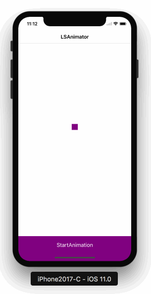

[](https://developer.apple.com/documentation/objectivec)&nbsp;
[](https://github.com/apple/swift)&nbsp;
[](http://cocoapods.org/pods/LSAnimator)&nbsp;
[](https://github.com/Carthage/Carthage)&nbsp;
[](https://travis-ci.org/Lision/LSAnimator)&nbsp;
[](https://raw.githubusercontent.com/Lision/LSAnimator/master/LICENSE)&nbsp;
[](http://cocoadocs.org/docsets/LSAnimator)&nbsp;
[](https://www.apple.com/nl/ios/)

> [中文介绍](https://github.com/Lision/LSAnimator/blob/master/README_ZH-CN.md)

> This project is inspired by [JHChainableAnimations](https://github.com/jhurray/JHChainableAnimations)!

# Why Choose LSAnimator & CoreAnimator?

You can write complex and easy-to-maintain animations in just a few lines of code by use LSAnimator(Objective-C) or CoreAnimator(Swift).

&nbsp;


# What's The Multi-chain Animations?

CAAnimations and UIView animations are extremely powerful, but it is very hard to read when the animation is complicated.

Say I want to move myView 100 pixels to the right with spring and then incre 30 pixels to the width with inward easing when the movement has finished:

### The Old Way

``` obj-c
[UIView animateWithDuration:2.0
                          delay:0.0
         usingSpringWithDamping:0.8
          initialSpringVelocity:1.0
                        options:0
                     animations:^{
                         CGPoint newPosition = self.myView.frame.origin;
                         newPosition.x += 100;
                         self.myView.frame = CGRectMake(newPosition.x, newPosition.y, self.myView.frame.size.width, self.myView.frame.size.height);
                     } completion:^(BOOL finished) {
                         [UIView animateWithDuration:2.0
                                               delay:0.0
                                             options:UIViewAnimationOptionCurveEaseIn
                                          animations:^{
                                              CGSize newSize = self.myView.frame.size;
                                              newSize.width += 30;
                                              self.myView.frame = CGRectMake(self.myView.frame.origin.x, self.myView.frame.origin.y, newSize.width, newSize.height);
                                          } completion:nil];
                     }];
```

Thats pretty gross huh... With LSAnimator it is one line of code.

### Using LSAnimator


``` obj-c
LSAnimator *animator = [LSAnimator animatorWithView:self.myView];
animator.moveX(100).spring.thenAfter(2).increWidth(30).easeIn.animate(2);
```

Emmmmm...There is an animation library called JHChainableAnimations can also do this.

## Whats wrong with JHChainableAnimations?

[JHChainableAnimations](https://github.com/jhurray/JHChainableAnimations) has powerful chainable animations AND easy to read/write syntax, but it does not support for Multi-chain Animations.

Following the example above, assume now that the whole animation chain above needs to change the transparency of myView to zero at the same time:

### Using LSAnimator


With LSAnimator it is just need to add one line of code.

``` obj-c
LSAnimator *animator = [LSAnimator animatorWithView:self.myView];
animator.moveX(100).spring.thenAfter(2).increWidth(30).easeIn.animate(2);
animator.concurrent.makeOpacity(0).animate(4);
```

### Using JHChainableAnimations


Emmmmm...With JHChainableAnimations it is can not finished task. Trying to add the following code will cause the animation bug or crash.

``` obj-c
JHChainableAnimator *animator = [[JHChainableAnimator alloc] initWithView:self.myView];
animator.moveX(100).spring.thenAfter(2).moveWidth(30).easeIn.animate(2);
animator.makeOpacity(0).animate(4);
```

# LSAnimator VS JHChainableAnimations

- **Multi-chain Animations:** Can complete all animation design needs, More flexible than JHChainableAnimations.
- **CALayer Support:** Support CALayer initialization, JHChainableAnimations only supports UIView.
- **Parameter Auto-completion:** Support parameter auto-completion, JHChainableAnimations does not support.

LSAnimator support parameter auto-completion, **including the number of parameters and parameter types**:


JHChainableAnimations is not friendly when actually writing code.


JHChainableAnimations is still a really good animation library and LSAnimator is standing on the shoulders of it.

# Features

- **Swift Support:** Swift 3.2 ~ 4 Support.
- **Friendly Swift Interface:** Added friendly Swift interface in separate framework.
- **Multi-chain Animations:** Can complete all animation design needs.
- **CALayer Support:** Support CALayer initialization.
- **Parameter Auto-completion:** Support parameter auto-completion.
- **Support for Animation Hooks:** Added pre-animation and post-animation hooks for each animation step. Added a final completion hook that fires when all animation chains have completed.
- **Non-intrusive:** There is no need to make the view/layer class inherit from other base class.

# Usage

### Creating an Animator

``` obj-c
// UIView initialization
LSAnimator *viewAnimator = [LSAnimator animatorWithView:self.myView];
LSAnimator *viewAnimator = [[LSAnimator alloc] initWithView:self.myView];

// CALayer initialization
LSAnimator *layerAnimator = [LSAnimator animatorWithLayer:self.myLayer];
LSAnimator *layerAnimator = [[LSAnimator alloc] initWithLayer:self.myLayer];
```

### Animating

Chainable properties like `moveX(x)` must come between the animator and the `animate(t)` function.

Below is an example of how to double an objects size over the course of one second.

``` obj-c
animator.makeScale(2.0).animate(1.0);
```


### Combining Animations

If you want to move the view while you scale it, add another chainable property. Order is not important.

``` obj-c
animator.makeScale(2.0).moveXY(100, 50).animate(1.0);
// the same as animator.moveXY(100, 50).makeScale(2.0).animate(1.0);
```


> Note: Combining Animations works only for the animation that needs to be done in the same step. 

If the animations have different durations. When they **can not be done in the same animation step**, they need to use **Multi-chain Animations**.

A full list of chainable properties can be found [here](#chainable-properties).

### Chaining Animations

To chain animations seperate the chains with the `thenAfter(t)` function.

Below is an example of how to scale and object for 0.5 seconds, and then move it for 1 second when that is done.

``` obj-c
animator.makeScale(2.0).thenAfter(0.5).moveXY(100, 50).animate(1.0);
```


### Animation Effects

Animation Effects
To add an animation effect, call the effect method after the chainable property you want it to apply to.

Below is an example of scaling a view with a spring effect.

``` obj-c
animator.makeScale(2.0).spring.animate(1.0);
```


If you add 2 to the same chainable property the second will cancel the first out.

``` obj-c
animator.makeScale(2.0).bounce.spring.animate(1.0);
// The same as animator.makeScale(2.0).spring.animate(1.0);
```

A full list of animation effect properties can be found [here](#animation-effects-1).

### Anchoring

To anchor your view call an achoring method at some point in an animation chain. Like effects, calling one after another in the same chain will cancel the first out.

Below is an example of rotating a view around different anchor points.

``` obj-c
animator.rotateZ(180).anchorTopLeft.thenAfter(1.0).rotateZ(90).anchorCenter.animate(1.0);
// animator.rotateZ(90).anchorTopLeft.anchorCenter == animator.rotateZ(90).anchorCenter
```


A full list of anchor properties can be found [here](#anchoring-1).

### Delays

To delay an animation call the `wait(t)` or `delay(t)` chainable property.

Below is an example of moving a view after a delay of 0.5 seconds.

``` obj-c
animator.moveXY(100, 50).wait(0.5).animate(1.0);
// The same as animator.moveXY(100, 50).delay(0.5).animate(1.0);
```

### Completion

To run code after an animation finishes call the `animateWithCompletion(t, completion)*` function.

``` obj-c
animator.makeX(0).animateWithCompletion(1.0, ^{
	NSLog(@"Animation Done");
});
```

### Repeating Animations

You can repeat an animation by replacing the `thenAfter(time)` method with the `repeat(time, count)` method. This will repeat the previously defined animations.

``` obj-c
animator.increWidth(30).spring.repeat(0.5, 3).moveXY(100, 50).animate(1.0);
```


You can repeat the last part of an animation by calling `animateWithRepeat(time, count)`.

``` obj-c
animator.increWidth(30).spring.animateWithRepeat(0.5, 3);
```


### Callbacks

You can hook into the different steps of the animation process by calling the `preAnimationBlock(block)` and `postAnimationBlock(block)` methods. All take a simple block `void(^block)(void)` as an argument. Order of calling these in the animation chain does not matter.

``` obj-c
animator.moveX(10).preAnimationBlock(^{
    NSLog(@"before the first animation");
}).thenAfter(1.0).postAnimationBlock(^{
    NSLog(@"After the second animation");
}).moveY(10).animate(1.0);
```

### Bezier Paths

You can also animate a view along a [UIBezierPath](https://developer.apple.com/library/content/documentation/2DDrawing/Conceptual/DrawingPrintingiOS/BezierPaths/BezierPaths.html). Create a `UIBezierPath *` instance, then add points or curves or lines to it and use it in a chainable property.

``` obj-c
UIBezierPath *path = [UIBezierPath bezierPath];
[path moveToPoint:self.myView.center];
[path addLineToPoint:CGPointMake(25, 400)];
[path addLineToPoint:CGPointMake(300, 500)];
animator.moveOnPath(path).animate(1.0);
```


## Using with Auto Layout

### Transforms

Use the **transform** chainable properties. These are better for views constrained with Autolayout. You should not mix these with other chainable properties.

``` obj-c
animatorForViewWithConstraints.transformX(50).transformScale(2).animate(1.0);
```

## Using with Swift

Using `LSAnimator` with [Swift](https://developer.apple.com/swift/) is now a little more readable in version 2.x. I created a separate framework for swift that provides a class called `CoreAnimator`. This is a thin wrapper over `LSAnimator` that has a slightly more readable syntax.

``` swift
let animator = CoreAnimator(view: myView)
animator.move(x: 60).thenAfter(t: 1.0).rotate(angle: 360).bounce.animate(t: 1.0)
```


## Chainable Properties

``` obj-c
#pragma mark - Animations
// Makes
// Affects views position and bounds
@property (nonatomic, copy, readonly) LSAnimatorRect makeFrame;
@property (nonatomic, copy, readonly) LSAnimatorRect makeBounds;
@property (nonatomic, copy, readonly) LSAnimatorSize makeSize;
@property (nonatomic, copy, readonly) LSAnimatorPoint makeOrigin;
@property (nonatomic, copy, readonly) LSAnimatorPoint makePosition;
@property (nonatomic, copy, readonly) LSAnimatorFloat makeX;
@property (nonatomic, copy, readonly) LSAnimatorFloat makeY;
@property (nonatomic, copy, readonly) LSAnimatorFloat makeWidth;
@property (nonatomic, copy, readonly) LSAnimatorFloat makeHeight;
@property (nonatomic, copy, readonly) LSAnimatorFloat makeOpacity;
@property (nonatomic, copy, readonly) LSAnimatorColor makeBackground;
@property (nonatomic, copy, readonly) LSAnimatorColor makeBorderColor;
@property (nonatomic, copy, readonly) LSAnimatorFloat makeBorderWidth;
@property (nonatomic, copy, readonly) LSAnimatorFloat makeCornerRadius;
@property (nonatomic, copy, readonly) LSAnimatorFloat makeScale;
@property (nonatomic, copy, readonly) LSAnimatorFloat makeScaleX;
@property (nonatomic, copy, readonly) LSAnimatorFloat makeScaleY;
@property (nonatomic, copy, readonly) LSAnimatorPoint makeAnchor;

// Moves
// Affects views position and bounds
@property (nonatomic, copy, readonly) LSAnimatorFloat moveX;
@property (nonatomic, copy, readonly) LSAnimatorFloat moveY;
@property (nonatomic, copy, readonly) LSAnimatorPoint moveXY;
@property (nonatomic, copy, readonly) LSAnimatorPolarCoordinate movePolar;

// Increments
// Affects views position and bounds
@property (nonatomic, copy, readonly) LSAnimatorFloat increWidth;
@property (nonatomic, copy, readonly) LSAnimatorFloat increHeight;
@property (nonatomic, copy, readonly) LSAnimatorSize increSize;

// Transforms
// Affects views transform property NOT position and bounds
// These should be used for AutoLayout
// These should NOT be mixed with properties that affect position and bounds
- (LSAnimator *)transformIdentity;
@property (nonatomic, copy, readonly) LSAnimatorDegrees rotate; // Same as rotateZ
@property (nonatomic, copy, readonly) LSAnimatorDegrees rotateX;
@property (nonatomic, copy, readonly) LSAnimatorDegrees rotateY;
@property (nonatomic, copy, readonly) LSAnimatorDegrees rotateZ;
@property (nonatomic, copy, readonly) LSAnimatorFloat transformX;
@property (nonatomic, copy, readonly) LSAnimatorFloat transformY;
@property (nonatomic, copy, readonly) LSAnimatorFloat transformZ;
@property (nonatomic, copy, readonly) LSAnimatorPoint transformXY;
@property (nonatomic, copy, readonly) LSAnimatorFloat transformScale; // x and y equal
@property (nonatomic, copy, readonly) LSAnimatorFloat transformScaleX;
@property (nonatomic, copy, readonly) LSAnimatorFloat transformScaleY;


#pragma mark - Bezier Paths
// Animation effects dont apply
@property (nonatomic, copy, readonly) LSAnimatorBezierPath moveOnPath;
@property (nonatomic, copy, readonly) LSAnimatorBezierPath moveAndRotateOnPath;
@property (nonatomic, copy, readonly) LSAnimatorBezierPath moveAndReverseRotateOnPath;
```

## Animation Effects

``` obj-c
- (LSAnimator *)easeIn;
- (LSAnimator *)easeOut;
- (LSAnimator *)easeInOut;
- (LSAnimator *)easeBack;
- (LSAnimator *)spring;
- (LSAnimator *)bounce;
- (LSAnimator *)easeInQuad;
- (LSAnimator *)easeOutQuad;
- (LSAnimator *)easeInOutQuad;
- (LSAnimator *)easeInCubic;
- (LSAnimator *)easeOutCubic;
- (LSAnimator *)easeInOutCubic;
- (LSAnimator *)easeInQuart;
- (LSAnimator *)easeOutQuart;
- (LSAnimator *)easeInOutQuart;
- (LSAnimator *)easeInQuint;
- (LSAnimator *)easeOutQuint;
- (LSAnimator *)easeInOutQuint;
- (LSAnimator *)easeInSine;
- (LSAnimator *)easeOutSine;
- (LSAnimator *)easeInOutSine;
- (LSAnimator *)easeInExpo;
- (LSAnimator *)easeOutExpo;
- (LSAnimator *)easeInOutExpo;
- (LSAnimator *)easeInCirc;
- (LSAnimator *)easeOutCirc;
- (LSAnimator *)easeInOutCirc;
- (LSAnimator *)easeInElastic;
- (LSAnimator *)easeOutElastic;
- (LSAnimator *)easeInOutElastic;
- (LSAnimator *)easeInBack;
- (LSAnimator *)easeOutBack;
- (LSAnimator *)easeInOutBack;
- (LSAnimator *)easeInBounce;
- (LSAnimator *)easeOutBounce;
- (LSAnimator *)easeInOutBounce;
```


A quick look at these funcs can be found [here](http://easings.net/)

These animation functions were taken from a cool keyframe animation library that can be found [here](https://github.com/NachoSoto/NSBKeyframeAnimation)

They are based off of JQuery easing functions that can be found [here](http://gsgd.co.uk/sandbox/jquery/easing/jquery.easing.1.3.js)

## Anchoring

``` obj-c
- (LSAnimator *)anchorDefault;
- (LSAnimator *)anchorCenter;
- (LSAnimator *)anchorTop;
- (LSAnimator *)anchorBottom;
- (LSAnimator *)anchorLeft;
- (LSAnimator *)anchorRight;
- (LSAnimator *)anchorTopLeft;
- (LSAnimator *)anchorTopRight;
- (LSAnimator *)anchorBottomLeft;
- (LSAnimator *)anchorBottomRight;
```

## Multi-chain Animations

You can add a new animation chain by calling the `concurrency` method. It does not affect the previous animation chains.

``` obj-c
animator.increWidth(20).spring.animateWithRepeat(0.5, 3);
animator.concurrent.makeBackground([UIColor orangeColor]).animate(1);
```


> Do not change the properties of the animation chain before the new animation chain operates at the same time.

``` obj-c
// Do not do this
animator.moveX(20).animate(1.0);
animator.concurrent.moveX(-20).animate(1.0);
```


## To Do

- Constraint animator

# Installation

### Cocoapods

#### Objective-C

1. Add `pod 'LSAnimator', '~> 2.1.3'` to your Podfile.
2. Run `pod install` or `pod update`.
3. Add `#import <LSAnimator/LSAnimator.h>`.

#### Swift

1. Add `pod 'CoreAnimator', '~> 2.1.3'` to your Podfile.
2. Run `pod install` or `pod update`.
3. Add `import CoreAnimator`.

### Carthage

1. Add `github "Lision/LSAnimator" ~> 2.1.3` to your Cartfile.
2. Run `carthage update --platform ios`.

#### Objective-C

Add the `LSAnimator` framework to your project.

#### Swift

Add the `CoreAnimator` framework to your project.

### Manually

Either clone the repo and manually add the Files in [LSAnimator](https://github.com/Lision/LSAnimator/tree/master/LSAnimator)

# Requirements

- LSAnimator requires `iOS 7.0+`.
- CoreAnimator requires `iOS 9.0+`.

# Contact

- Email: lisionmail@gmail.com
- Sina: [@Lision](https://weibo.com/5071795354/profile)
- Twitter: [@Lision](https://twitter.com/LisionChat)

# License

[](https://raw.githubusercontent.com/Lision/LSAnimator/master/LICENSE)

LSAnimator is provided under the MIT license. See LICENSE file for details.
